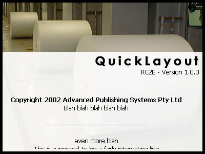

<div align="center">

## Another Flicker Free About Box


</div>

### Description

Yet another flicker free about form. <BR>

Major differences between this and the other dozen on PSC: This one draws over a background picture, this one is a single form solution, this one has mouse capture to stop the scroll. <BR>

I've tried to make this form so it's a "drop in and go" type setup. Add the form, change the picture in picOut, move and resize picBackBuffer to where you want the text to scroll and it *should* work. <BR>

In order for the mouse out tracking to work, you need ssubtmr6 from vbaccelerator - http://www.vbaccelerator.com/codelib/ssubtmr/ssubtmr.htm . If you don't want to use this functionality, just change HASH_CON_TRACKMOUSE from True to False. Voila, no implemented interface and no subclassing :) <BR>

I originally based this off Mark Robert Strange's flicker free gradient credit box, there's very, very little of that code left in this one though :) But, still, he was the guy who gave me the idea, so I'd better credit him! <BR>

[edited: trying to get the line breaks happy] <BR> [edited: and again]
 
### More Info
 
requires ssubtmr6 from vbaccelerator for the mouseout tracking - http://www.vbaccelerator.com/codelib/ssubtmr/ssubtmr.htm


<span>             |<span>
---                |---
**Submitted On**   |2002-06-11 03:33:40
**By**             |[DanF](https://github.com/Planet-Source-Code/PSCIndex/blob/master/ByAuthor/danf.md)
**Level**          |Intermediate
**User Rating**    |5.0 (30 globes from 6 users)
**Compatibility**  |VB 6\.0
**Category**       |[Graphics](https://github.com/Planet-Source-Code/PSCIndex/blob/master/ByCategory/graphics__1-46.md)
**World**          |[Visual Basic](https://github.com/Planet-Source-Code/PSCIndex/blob/master/ByWorld/visual-basic.md)
**Archive File**   |[Another\_Fl925376102002\.zip](https://github.com/Planet-Source-Code/danf-another-flicker-free-about-box__1-35683/archive/master.zip)

### API Declarations

```
TrackMouseEvent
BitBlt
```


